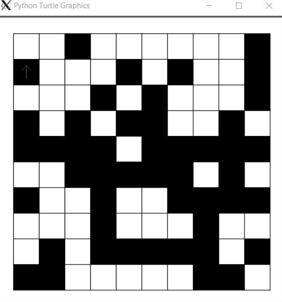
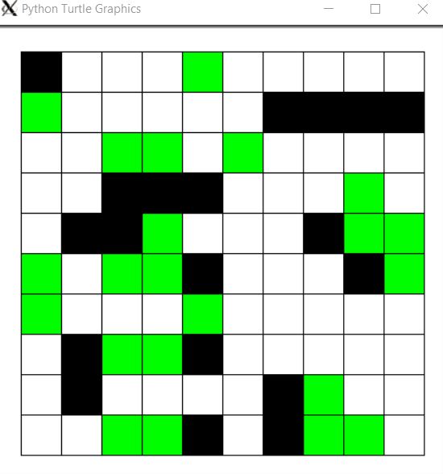

# Simulations

This was my submission for my second assignment of Programming IV at CEGEP Heritage.

There are two simulations herein: [Conways's Game of Life](https://en.wikipedia.org/wiki/Conway%27s_Game_of_Life) and [Langton's ant](https://en.wikipedia.org/wiki/Langton%27s_ant). You can read how they work on their respective Wikipedia pages.

Both are built using TKinter and Python 3.

# Recordings

## Ant



_The "Ant" points to the next cell it is going to go to._

## Game of Life



_Each generation has a new color. This lets us clearly see which cells are new, and which cells are old._

# Controls

<table>
    <tr>
        <td>Start simulation</td>
        <th><kbd>S</kbd></th>
    </tr>
    <tr>
        <td>Pause</td>
        <th><kbd>P</kbd></th>
    </tr>
    <tr>
        <td>Increase speed</td>
        <th><kbd>↑</kbd></th>
    </tr>
    <tr>
        <td>Decrease speed</td>
        <th><kbd>↓</kbd></th>
    </tr>
    <tr>
        <td>Load file</td>
        <th><kbd>F</kbd></th>
    </tr>
    <tr>
        <td>Random</td>
        <th><kbd>R</kbd></th>
    </tr>
    <tr>
        <td>Quit</td>
        <th><kbd>Q</kbd></th>
    </tr>
</table>

## Running

Under normal circumstances, simply running `python3 game_of_life.py` or `python3 ant.py` will be sufficient.

If running under WSL you will need install and [X Server](https://sourceforge.net/projects/xming/) and run it with a `DISPLAY` environment variable:

```
DISPLAY=:0 python3 game_of_life.py
```
